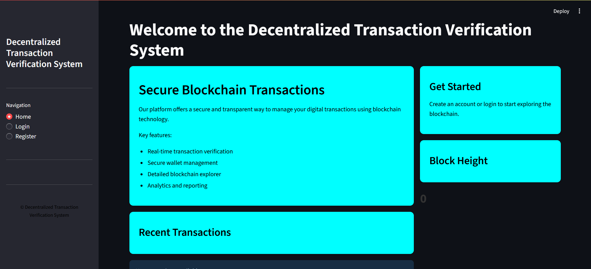
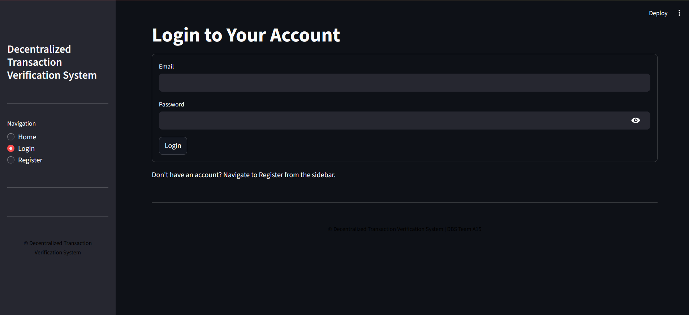
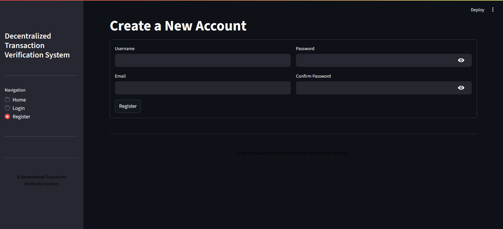
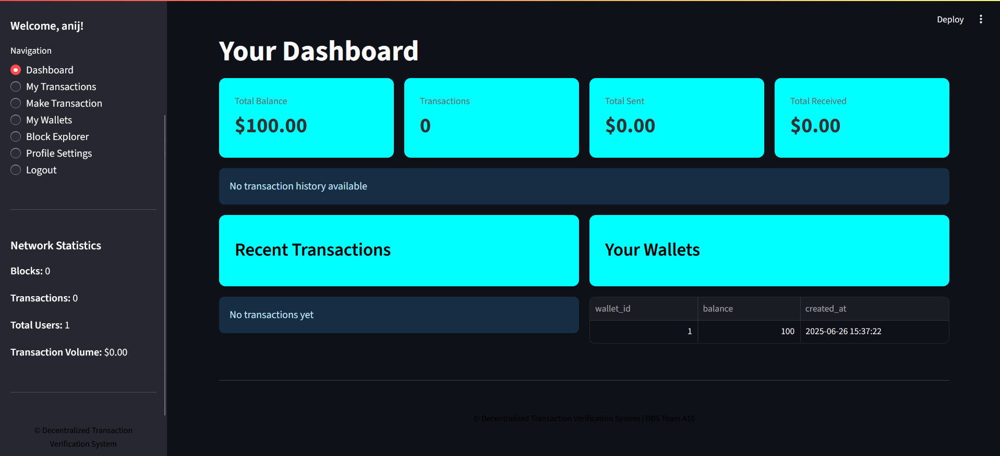

# 🛡️ Decentralized Transaction Verification System

This project simulates a **decentralized system for verifying financial transactions** using a relational database (SQL) and Python. It models blockchain-like logic such as immutability, smart contract behavior, and validation rules — but with a lightweight SQL-based backend.

---

## 📌 Table of Contents

- [About the Project](#-about-the-project)
- [Tech Stack](#-tech-stack)
- [Core Components](#-core-components)
- [Database Design](#--database-design)
- [Setup Instructions](#--setup-instructions)
- [How It Works](#-how-it-works)
- [Screenshots](#-screenshots)
- [Future Enhancements](#-future-enhancements)
- [Contact](#-contact)

---

## 🧠 About the Project

A **proof-of-concept system** to demonstrate transaction validation and data integrity using:

- SQL **triggers**, **procedures**, and **functions** for automatic verification
- Python for interacting with the database
- Concepts inspired by blockchain — such as decentralized validation logic, tamper-proof records, and automated enforcement of rules

This project is perfect for understanding how database features can simulate blockchain-like security and automation — **without requiring a distributed ledger**.

---

## 🧰 Tech Stack

| Layer      | Technology               |
|-----------|---------------------------|
| Language   | Python 3                 |
| Database   | MySQL / PostgreSQL       |
| SQL Logic  | Triggers, Procedures, Functions |
| Python DB | `mysql-connector-python` |
| IDE        | VS Code / MySQL Workbench |

---

## 🧩 Core Components

| File/Folder        | Purpose |
|--------------------|---------|
| `app.py`           | Python script to trigger transactions |
| `database.py`      | Handles DB connection and execution |
| `schema.sql`       | Creates required tables |
| `triggers.sql`     | Adds verification logic for transactions |
| `procedures.sql`   | Creates reusable stored procedures |
| `functions.sql`    | Adds utility functions for validation |
| `__pycache__/`     | Python bytecode (auto-generated, ignored) |

---

## 🗃️ Database Design

The system includes:

- **Users Table**: Holds sender and receiver details
- **Transactions Table**: Logs each transaction with timestamp, amount, parties
- **Triggers**:
  - Validate balance before a transaction
  - Automatically reject invalid transactions
- **Procedures**:
  - Transfer funds safely with rollback logic
- **Functions**:
  - Check available balance
  - Compute fees or hashes (optional)

---

## ⚙️ Setup Instructions

### 1. Clone the Repository

```bash
git clone https://github.com/yourusername/decentralized-tx-verification.git
cd decentralized-tx-verification
```

### 2. Create the Database
Make sure MySQL is running and accessible.

```bash
mysql -u root -p
```

Then, run these scripts in order:

```bash
source sql/schema.sql;
source sql/functions.sql;
source sql/procedures.sql;
source sql/triggers.sql;
```

### 3. Install Dependencies

```bash
pip install mysql-connector-python
```

### 4. Run the Python App

```bash
cd backend
streamlit run app.py
```

You’ll see transaction logs and verification results in the console.

## 🧪 How It Works

    User initiates a transaction using app.py.

    Python connects to the MySQL database via database.py.

    SQL procedures handle money transfer, ensuring:

        Valid user IDs

        Sufficient balance

    SQL triggers run automatically to:

        Validate transactions

        Reject fraudulent ones

    Transaction is logged only if all checks pass.

Think of it like a basic blockchain node that:

    Authenticates

    Verifies

    Logs — without manual intervention

## 📸 Screenshots









## 🔮 Future Enhancements

    📊 Add real-time transaction visualizer (blockchain-style ledger)

    🔏 Implement hashing to simulate blocks

    🧠 Add AI-based anomaly detection for fraud prevention

    📩 Email or SMS confirmation on successful transaction

## 📬 Contact

Author: Anij Mehta, Kewal Thacker, Piyush Verma<br>
GitHub: @anij-mehta<br>
LinkedIn: linkedin.com/in/anij-mehta
